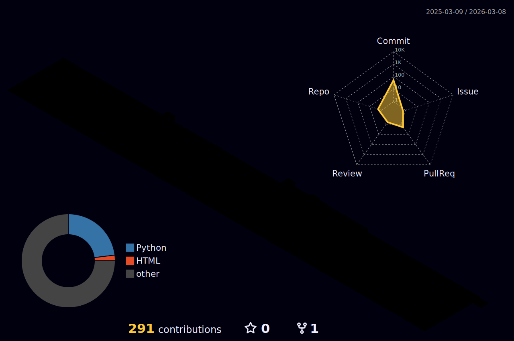

<!-- GITHU### 💻 About Me

<table>
<tr>
<td width="70%" valign="top">

🖥️ I'm currently working on <b>DevOps Projects</b> 
🌱 I'm currently learning <b>Ansible, Data Structures, Jenkins</b> 
💬 Ask me about <b>Ethical Hacking, Bug Bounty, Data Structures</b> 
📧 Reach me at <a href="mailto:hingepoorvaj@gmail.com">hingepoorvaj@gmail.com</a> 
🎯 Trying to automate everything I can 🚀 
🎹 Fun fact: I love playing the keyboard

</td>
<td width="30%" valign="top">

</td>
</tr>
</table>OR POORVAJ HINGE -->

<h1 align="center">Hi 👋, I'm Poorvaj Hinge</h1>
<h3 align="center">A dedicated DevOps and Software Engineering professional with deep expertise in Linux, Networking, and Cybersecurity. Skilled in building secure CI/CD pipelines, infrastructure automation, and cloud technologies, alongside strong penetration testing capabilities.</h3>

  

### 💻 About Me

  

    🖥️ I’m currently working on <b>DevOps Projects</b> 
    🌱 I’m currently learning <b>Ansible, Data Structures, Jenkins</b> 
    💬 Ask me about <b>Ethical Hacking, Bug Bounty, Data Structures</b> 
    📧 Reach me at <a href="mailto:hingepoorvaj@gmail.com">hingepoorvaj@gmail.com</a> 
    🎯 Trying to automate everything I can 🚀 
    🎹 Fun fact: I love playing the keyboard
  

  

    
  

### ☎️ Connect with Me

  
  
  
  

### 🧑‍💻 Tech Stack

  

#### 💡 Languages:

#### 🔧 Tools & Frameworks:

  

  

    
  

#### ☁️ Cloud & DevOps:

#### 🧠 Data & Databases:

#### 🧪 Other Tools:

#### 🎯 Operating Systems & Virtualization:

---

## ⭐️ From [Poorvaj Hinge](https://github.com/hingepoorvaj)

  
  
  
  
  

